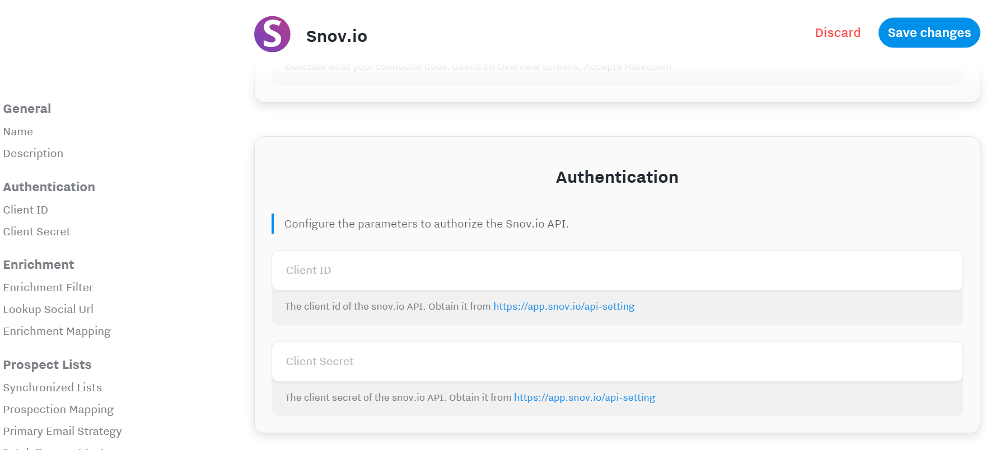
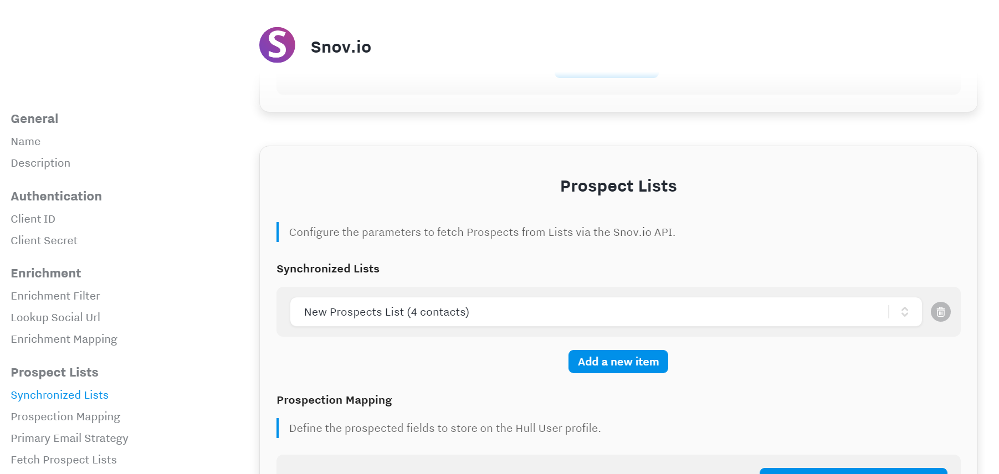
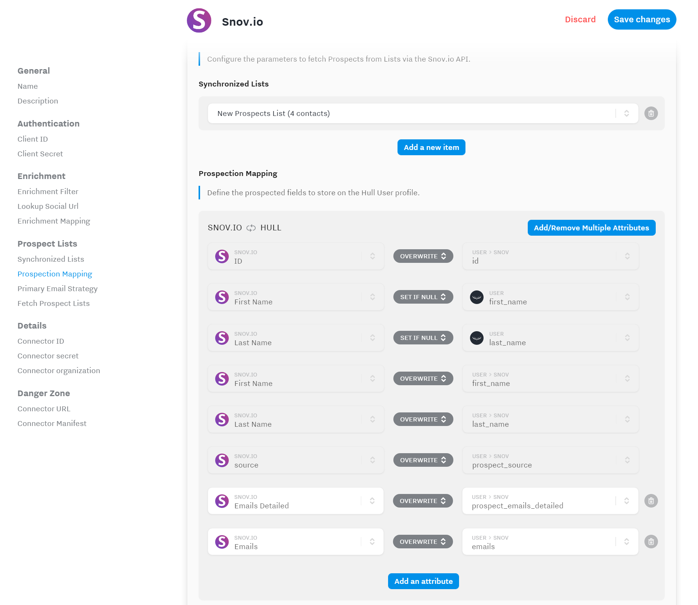

# Snov.io _BETA_

> This connector is under active development. The documentation might not be complete and features are subject to change. Please refer to the roadmap section for planned enhancements.

## Getting Started

1. From your Hull Connectors page click on `[Add a Connector]`
2. Search for "Snov" and click on `[Install]`
3. Authorize Hull to connect with the Snov.io API by navigating to Authentication in the Settings:
   

## Enrichment by Social Url

> This section is not available yet.

## Fetch Prospect Lists

Configure from which lists you want to fetch Prospects for by defining them under **Synchronized Lists**.

Next proceed by reviewing the attribute mappings under **Prospection Mapping** and make changes to suite your attribute naming conventions in Hull:

Make sure the **Save changes** after you completed your configuration. You can start fetching Prospects from the configured lists by clicking the button **Fetch Prospect Lists**. The connector automatically synchronizes lists every 3 hours, see the FAQ section for more details.

## FAQ

### When is data enriched

**Outgoing data** (from Hull to Snov.io) is sent almost immediately. You can check the backlog on the _Overview_ page of your Snov.io Connector to see if there is any delay. Thus enrichment is almost immediate, however it might take snov.io to respond to the requested enrichment which is outside of the control of the Connector.

### How often are Prospect Lists synchronized

Prospect Lists are synchronized every 3 hours from Snov.io. You can check the Logs tab for `incoming.user.success` logs.
You can always fetch lists manually by clicking on the **Fetch Prospect Lists** button in the Settings section "Prospect Lists".

## Roadmap

The following table describes the current roadmap. If you like to request additions, please use the [GitHub Issues Page](https://github.com/SMK1085/hull-snovio/issues).

| Priority | Estimated Delivery Date | Feature Description          |
| -------- | ----------------------- | ---------------------------- |
| 1        | TBD                     | Add Domain V2 Search         |
| 2        | TBD                     | Full automated test coverage |

Note that elements which are striked through have been deployed and are ready for you to test.
